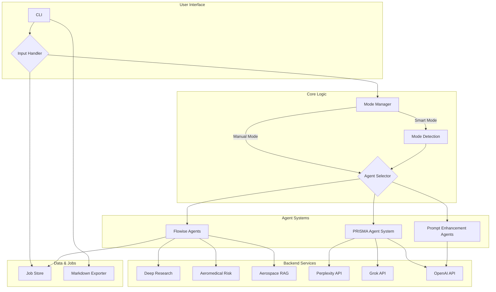

# Advanced Aeromedical Evidence Review & Research System

This repository contains a sophisticated, multi-agent AI framework designed for advanced aeromedical research, automated systematic reviews (PRISMA), and specialized risk assessments. It leverages a powerful command-line interface (CLI) to interact with a suite of AI agents, each tailored for a specific task.

## Key Features

-   **🔬 Multi-Agent Architecture**: Utilizes a collection of distinct AI agents that can be invoked to handle complex research, analysis, and data synthesis tasks.
-   **🎯 Smart Mode Detection**: Intelligently analyzes the user's query to automatically select the most appropriate agent, streamlining the workflow.
-   **📊 PRISMA Systematic Reviews**: Features a dedicated agent system that automates the process of conducting PRISMA 2020-compliant systematic reviews, from initial query to structured report generation.
-   **🌐 Specialized Knowledge Integration**: Integrates with external knowledge bases and APIs, including Perplexity, Grok, and custom Flowise instances, to access specialized medical and aerospace data.
-   **⚡ Asynchronous Job Handling**: Long-running tasks, such as deep research via Flowise, are handled as background jobs, allowing you to continue working and check their status later.
-   **📝 Professional Exporting**: Easily export single responses, full conversation histories, or structured reports to clean, well-formatted Markdown files.
-   **🔧 Rich Command-Line Interface**: An enhanced CLI provides a rich user experience with multiline input, command history, and contextual help.
-   **⚙️ Flexible Configuration**: All major components, including API keys and agent behavior, can be configured through environment variables.

## System Architecture

The application is built around a modular architecture that separates concerns between the user interface, mode management, and the underlying AI agent systems.



## Installation

1.  **Clone the Repository:**
    ```bash
    git clone <repository-url>
    cd textappv2
    ```

2.  **Install Dependencies:**
    It is recommended to use a virtual environment.
    ```bash
    python -m venv venv
    source venv/bin/activate  # On Windows, use `venv\Scripts\activate`
    pip install -r requirements.txt
    ```

3.  **Configure Environment Variables:**
    Create a `.env` file in the project root. You can copy the `.env.example` if it exists, or create a new file.

    ```env
    # --- Core Functionality (Required) ---
    OPENAI_API_KEY="your_openai_api_key_here"
    FLOWISE_API_KEY="your_flowise_api_key_here"
    FLOWISE_API_URL="https://your.flowise.instance.com" # Optional, defaults to cloud version

    # --- PRISMA and Advanced Research (Required for those features) ---
    PPLX_API_KEY="your_perplexity_api_key_here"
    XAI_API_KEY="your_grok_xai_api_key_here"

    # --- Flowise Chatflow IDs (Optional Overrides) ---
    # Use these if you have custom Flowise chatflows. Defaults are provided.
    # CHATFLOW_AEROMEDICAL_RISK="your_chatflow_id"
    # CHATFLOW_DEEP_RESEARCH="your_chatflow_id"
    # CHATFLOW_AEROSPACE_MEDICINE_RAG="your_chatflow_id"
    ```

## How to Use

### Running the Application

The recommended way to run the application is using the `run.py` script from the project root.

```bash
python run.py
```

You can also use command-line arguments for specific tasks:

-   **Start in a specific mode:**
    ```bash
    python run.py --mode prisma
    ```
-   **Run a single query and exit:**
    ```bash
    python run.py --mode prompt --query "Explain the theory of relativity in simple terms."
    ```

### Interactive Commands

The application provides a rich set of commands for interacting with the system. Type `?` or `/help` for a full, context-aware list.

| Command | Description |
| :--- | :--- |
| `?` or `/help` | Show the contextual help message. |
| `/modes` | List all available processing modes. |
| `/smart`, `/prompt`, etc. | Switch to a specific mode. |
| `/transfer <mode>` | Re-runs the last query in a different mode. |
| `/history` | Show the current conversation history. |
| `/jobs` | View the status of background jobs. |
| `/export` | Export the last response to a Markdown file. |
| `/save` | Export the entire conversation to Markdown. |
| `/clear` | Clear the current conversation history. |
| `/quit` | Exit the application. |

### Processing Modes

You can manually switch modes to direct your query to a specific agent system.

-   **Smart (`/smart`)**: The default mode. It analyzes your question and routes it to the most suitable agent.
-   **Prompt (`/prompt`)**: A general-purpose agent for prompt enhancement and complex questions.
-   **Deep Research (`/deep`)**: A Flowise-powered agent for in-depth research. This is a background job.
-   **Aeromedical Risk (`/aero`)**: A specialized Flowise agent for assessing aeromedical risks. This is a background job.
-   **Aerospace Medicine RAG (`/aerospace`)**: A Flowise RAG agent to query a curated library of aerospace medicine literature. This is a background job.
-   **PRISMA (`/prisma`)**: Initiates the multi-agent systematic review workflow. This is an interactive, multi-step process.

### Background Jobs

For modes that take a long time to complete (like `/deep` or `/aero`), the system submits them as a background job.

-   You will be notified that a job has been submitted.
-   You can check the status of all jobs with the `/jobs` command.
-   Once a job is complete, the results will be automatically saved to a Markdown file in the `exports/` directory.

## ⚠️ Disclaimer

This is a research tool and is **not intended for operational use**. The information provided is not a substitute for professional medical or safety advice from qualified experts. All outputs must be independently verified. 